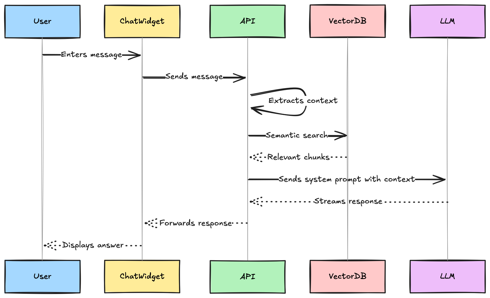
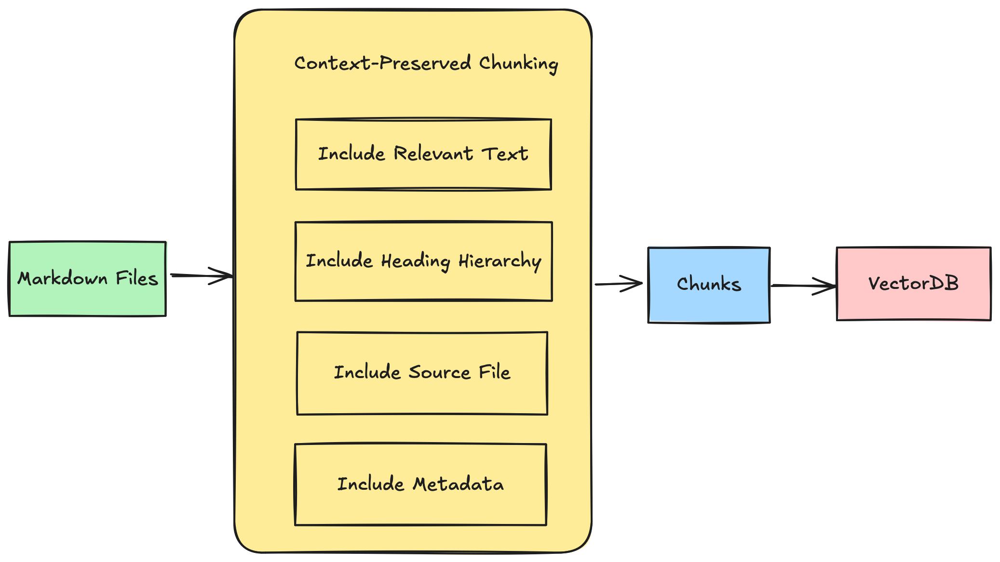

# Trung Ung | Portfolio 2025

> Modern web portfolio in Helsinki 🇫🇮 | [trungung.com](https://trungung.com)

  


## Overview

My personal portfolio showcases my work and technical philosophy: modern, performant, accessible, and maintainable. Built with Next.js 15, React 19, and Tailwind CSS 4.

### Key Features

- **AI-Powered Chatbot** — Context-aware assistant using RAG architecture
- **Modern MDX Content** — Type-safe content with Zod validation
- **Blog Platform** — Tag filtering and responsive design
- **Interactive Projects** — Galleries and detailed case studies

## Technical Architecture

### Core Stack

- **Frontend:** Next.js 15 (App Router), React 19, TypeScript, Tailwind CSS 4
- **Content:** MDX modules with typed exports, Zod validation
- **UI Components:** Shadcn UI, Framer Motion, next-themes

### AI Implementation (TrungBot)

TrungBot is an AI assistant leveraging RAG architecture to provide context-aware responses and improve user experience. Trungbot can answer questions about my work, projects, blogs and technical interests,...

- **Vector Store:** Upstash Vector with direct API integration
- **Language Model:** Azure OpenAI GPT-4.1 via @ai-sdk
- **Edge Deployment:** Vercel Edge Runtime for serverless execution
- **Build-time Processing:** Document embedding with zero runtime overhead

### 🧠 RAG Architecture Highlights

**RAG System Overview**

_High-level overview of the RAG-based chatbot and retrieval pipeline._

**Context-Preserved Chunking**

_Diagram of the chunking and metadata enrichment process for markdown content._

- **Smart Semantic Chunking**: Custom document processing that preserves heading hierarchies, maintains document structure, and creates semantically meaningful chunks based on natural paragraph boundaries.
- **Metadata-Enhanced Retrieval**: Each chunk contains rich metadata including section breadcrumbs, source information, and document hierarchy for improved context preservation.
- **Multi-Message Retrieval**: Enhanced vector search using contextual information from previous exchanges in the conversation.
- **Build-time Processing Pipeline**: Document embedding and vector generation during build time, with zero runtime embedding overhead or dependencies.
- **Configurable Chunking Strategy**: Fine-tuned document splitting based on semantic boundaries with configurable chunk sizes.

### Content Management

- MDX files as modules exporting metadata and React components
- Server Components for optimal MDX rendering
- Static generation with dynamic imports for efficient loading
- SEO-optimized metadata from content

## Project Structure

```
/src
  /app          # Next.js App Router pages and layouts
    /api        # API routes including chat endpoint
    /blog       # Blog pages with [slug] dynamic routes
  /components   # Reusable UI components
    /ui         # Base UI primitives (shadcn/ui)
    /chat       # AI chat components with @ai-sdk integration
  /content      # Centralized MDX content with typed exports
    /blogs      # Blog post MDX files with metadata
    /projects   # Project MDX files with rich metadata
    /mics       # Miscellaneous content
  /lib          # Utility functions and logic
    /vectorStore      # Embedding + retrieval system
    /chat             # Chat context handling
  /icons        # Custom SVG icons
  /assets       # Static assets (images, etc.)
```

## Running Locally

```bash
# Clone and install
git clone https://github.com/trungung/portfolio2025.git
npm install

# Development
npm run dev

# Optional: Generate chatbot embeddings
npm run build

# Production build
npm run build
```

Visit http://localhost:3000

## Connect

- 💼 [LinkedIn](https://linkedin.com/in/trung-ung)
- 🐙 [GitHub](https://github.com/trungung)
- 📧 ungkientrung@gmail.com

## License

MIT © Trung Ung
